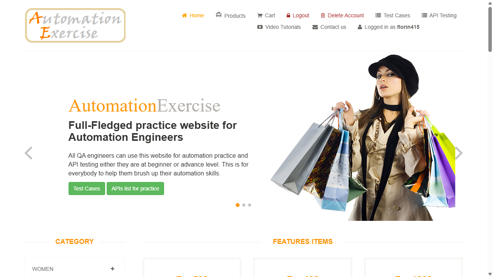
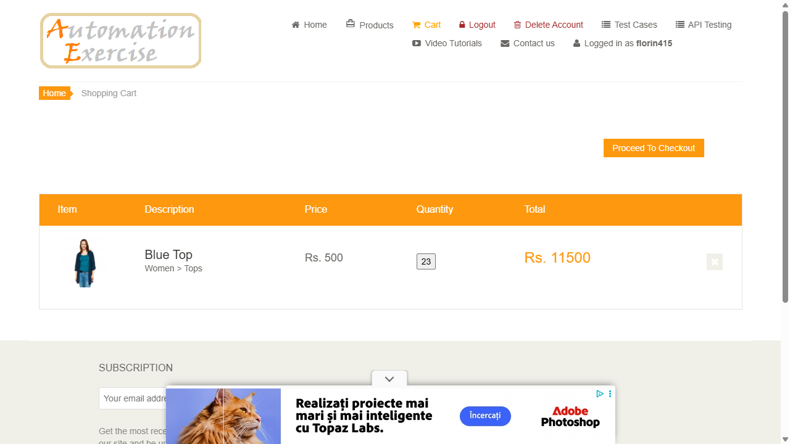

# Web Automation Testing

Automation testing project using **Cucumber** (BDD), **Playwright**, and **TypeScript**.

## Tech Stack

- **Cucumber** — Behavior Driven Development (Gherkin scenarios)
- **Playwright** — Browser automation (Chromium)
- **TypeScript** — Type-safe test code
- **ts-node** — TypeScript execution

## Test Scenarios

- User login (successful and unsuccessful)
- Add to cart functionality
- Authentication flow validation

## How to Run

```bash
npm run test
```

## Project Structure

```
src/tests/
├── features/       # Gherkin .feature files
├── hooks/          # Before/After hooks
└── steps/          # Step definitions
```

## Screenshots


*Login test passing*


*Add to cart test*

## Reports

- HTML report: `cucumber-report.html`
- Screenshots on failure: `test-results/`
